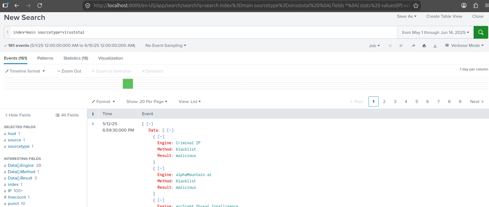
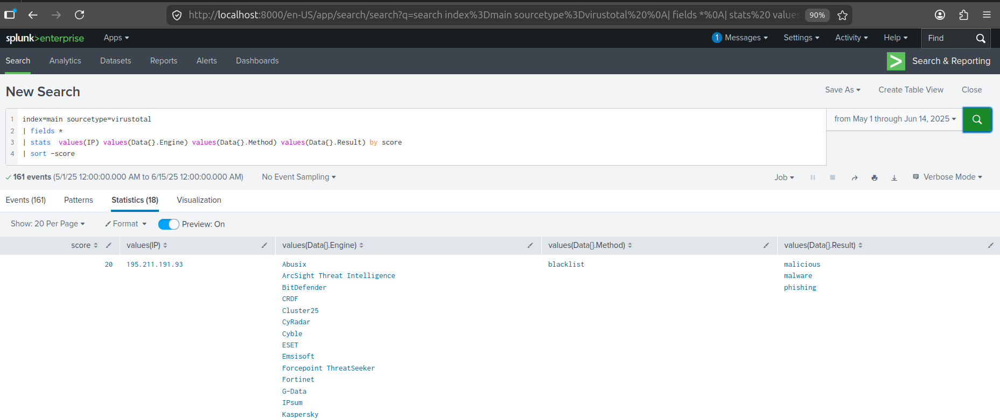
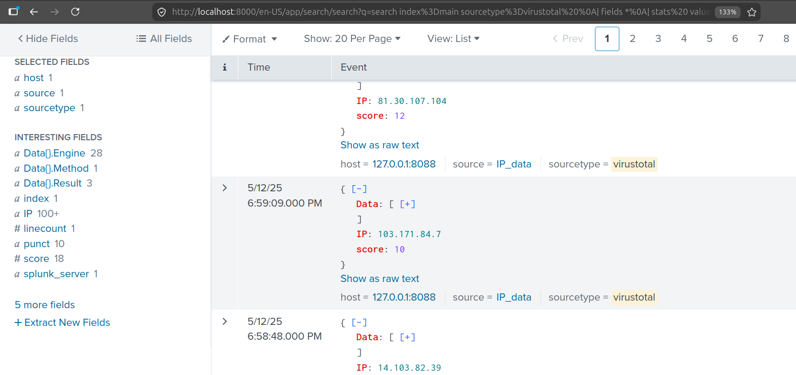

# Threat Intelligence Enrichment Pipeline (AbuseIPDB → VirusTotal → Splunk)
A Python-based threat intelligence automation pipeline that pulls
high-confidence malicious IPs from AbuseIPDB, enriches them with
VirusTotal reputation data, and forwards the combined intelligence to
Splunk via HTTP Event Collector (HEC) for analyst consumption.

## Why this exists
SOC analysts often manually pivot between threat intel sources to
qualify suspicious IPs. This pipeline automates the enrichment step:
given a list of known-malicious IPs from AbuseIPDB, it retrieves
VirusTotal verdicts and ships the combined data into Splunk where it
can be searched, dashboarded, and correlated with internal logs.

## Architecture
AbuseIPDB API -> ABUSEIPDB_IPs.csv -> main.py -> VirusTotal API -> Splunk HEC -> index=main
Two-stage design (collect, then enrich) was chosen to handle
AbuseIPDB's free-tier limit of 5 requests — caching to CSV lets the
enrichment run repeatedly without breaking AbuseIPDB quota.


## Screenshots








## Features
- Pulls IPs from AbuseIPDB filtered by confidence ≥ 90%
- Caches the IP list to CSV to respect AbuseIPDB free-tier limits
- Enriches each IP with VirusTotal scan results (engines, methods, verdicts)
- Tracks already-processed IPs in a local file to avoid duplicate API calls
- Filters output to malicious verdicts only — reduces noise in Splunk
- Forwards structured JSON events to Splunk HEC with a configurable sourcetype
- Implements 20-second delay between VirusTotal calls to respect the 4/min free-tier limit

## Tech stack
- Python 3
- AbuseIPDB API v2
- VirusTotal API v3
- Splunk HEC (HTTP POST with token auth)
- `requests`, `pandas`, `json`

## Files
- `ABUSEIPDB_IP_COLLECTION.py` — fetches the IP list from AbuseIPDB, writes to `ABUSEIPDB_IPs.csv`
- `main.py` — reads the CSV, queries VirusTotal for each IP, forwards malicious results to Splunk
- `ABUSEIPDB_IPs.csv` — sample IP list (regenerate with the collection script)
- `collected_IPs.txt` — tracks already-processed IPs (auto-created on first run)

## Setup

### Prerequisites
- Python 3.8+
- An AbuseIPDB API key — https://www.abuseipdb.com/api
- A VirusTotal API key — https://www.virustotal.com/
- A Splunk instance (Enterprise or Free) with HEC enabled

### Configuring Splunk HEC
1. Settings → Data Inputs → HTTP Event Collector → New Token
2. Set sourcetype to `_json` or accept the script-defined `virustotal`
3. Note the token and HEC port (default 8088)

### Configure the scripts
Replace the placeholder strings in the two Python files:
- `'abuseipdb-key'` in `ABUSEIPDB_IP_COLLECTION.py`
- `'your-virustotal-api-key'` and `'your-Splunk-HEC-token'` in `main.py`

### Run
```bash
python ABUSEIPDB_IP_COLLECTION.py
python main.py
```

## Sample event in Splunk
After enrichment, each event indexed in Splunk looks like:

```json
{
  "IP": "x.x.x.x",
  "score": 12,
  "Data": [
    { "Engine": "Fortinet", "Method": "blacklist", "Result": "malware" },
    { "Engine": "Sophos", "Method": "blacklist", "Result": "malicious" }
  ]
}
```

## What I learned
- API rate limits drive design decisions. A two-stage pipeline with disk caching is much cleaner than chained live calls when each API has different limits.
- Splunk HEC is a powerful pattern for ingesting custom data — sending JSON with `sourcetype=virustotal` makes the fields immediately available for search.
- Tracking processed items in a simple text file is a low-cost way to make scripts idempotent and re-runnable.
- Filtering verdicts before indexing (only malicious results) keeps Splunk costs down and the data more actionable.

## Limitations and known issues
- API keys are hardcoded — should be moved to environment variables
- No retry/backoff on network errors
- Single-threaded; would benefit from async for larger IP lists
- Splunk HEC POST uses `verify=False` for local development; production use should validate certificates

## Future improvements
- Move secrets to environment variables or a config file
- Add structured logging instead of print statements
- Replace the text-file dedup cache with SQLite for queryability
- Containerize with Docker for portable deployment
- Add Sigma rule mapping based on the enriched data

## License
MIT

